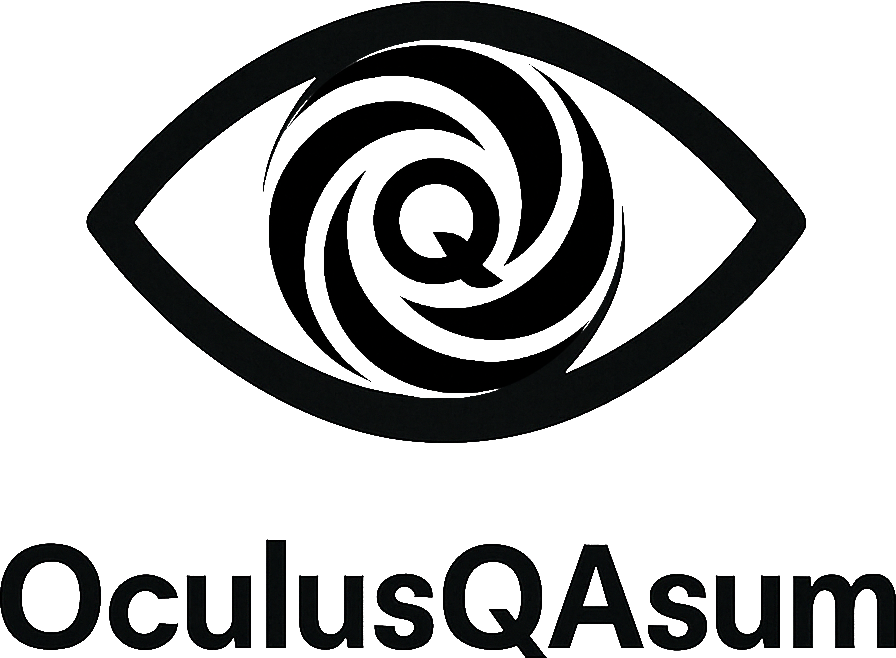

<p align="center">
  
</p>

---

*motto*
> **Oculus Q**uod **A**ssumit.  
> *The eye that takes what it takes.*

---

## Vision

_Those are eyes, I swear._

OculusQAsum is a powerful visual QA system that bridges the gap between design and development, ensuring pixel-perfect implementation of web interfaces. It automatically detects visual inconsistencies, generates tickets, fixes bugs, and monitors for regressions - all with a blend of technical precision and intelligent automation.

What sets it apart from tools that inspired it (Percy, Chromatic, etc) is that OculusQAsum goes further, opening and resolving issues using your ticket tracker and submitting PRs with tested fixes for the issues.

## Features

- **Visual Inconsistency Detection**: Pixel-perfect comparison between design mockups and developed UI
- **Auto-Generated GitHub Issues**: Creates detailed tickets with visual evidence and priority labels
- **LLM-Powered Bug Fixing**: Uses AI to analyze discrepancies and generate code fixes
- **Automated Pull Requests**: Creates PRs with suggested fixes for quick resolution
- **Continuous Monitoring**: Prevents visual regressions through scheduled checks
- **Multi-Viewport Testing**: Verifies consistency across desktop, tablet, and mobile views
- **Real-time Alerts**: Integrates with Slack, Teams, and email for instant notifications

## Quick Start

```bash
# Install globally
npm install -g oculus-qasum

# Initialize in your project
npx oculus-qasum init

# Compare design with implementation
npx oculus-qasum compare --design path/to/design.png --implementation https://yourapp.com

# Start monitoring to prevent regressions
npx oculus-qasum monitor --create-baselines
```

## How It Works

OculusQAsum works through four main components:

1. **Comparison Engine**: Captures and compares screenshots with advanced image analysis
2. **Issue Tracker**: Manages the entire bug lifecycle from detection to resolution
3. **Fix Generator**: Uses AI to understand visual discrepancies and generate code fixes
4. **Live Monitor**: Continuously watches for regressions in your production environment


## Installation

See our detailed [Installation Guide](INSTALL.md) for complete setup instructions.

### Quick Install

```bash
# Clone the repository
git clone https://github.com/scottvr/oculus-qasum.git
cd oculus-qasum

# Install dependencies
npm install

# Setup configuration
cp .env.example .env
# Edit .env with your API keys

# Run the CLI
./cli.js init
```

## Configuration

OculusQAsum is highly configurable through a YAML configuration file:

```yaml
comparison:
  thresholds:
    pixelDifference: 0.05
  browser:
    headless: true
  llm:
    enabled: true
    model: "gpt-4-vision-preview"

github:
  owner: "your-username"
  repo: "your-repo"
  issueLabels: ["visual-regression", "automated"]

# Additional configuration options...
```

See [Configuration Reference](docs/configuration.md) for all available options.

## 🖥️ CLI Commands

OculusQAsum provides an intuitive command-line interface:

```
Commands:
  init                       Initialize OculusQAsum in the current directory
  compare [options]          Compare design mockup with implementation
  monitor [options]          Start continuous monitoring for visual regressions

Options:
  -v, --version              Display version information
  -h, --help                 Display help information
```

See [CLI Reference](docs/cli-reference.md) for detailed command documentation.

## API Usage

OculusQAsum can be used programmatically in your Node.js applications:

```javascript
const { OculusQAsum } = require('oculus-qasum');

// Initialize with configuration
const oqa = new OculusQAsum({
  comparison: {
    thresholds: { pixelDifference: 0.05 }
  }
});

// Run automated visual QA workflow
async function runVisualQA() {
  const results = await oqa.runWorkflow(
    'https://figma.com/file/abc123',
    'https://myapp.com/component',
    '.hero-section',
    sourceCode,
    { componentName: 'Hero Section' }
  );
  
  console.log(results);
}
```

See [API Reference](docs/api-reference.md) for complete documentation.

## 🔌 Integrations

OculusQAsum integrates with popular design, development, and communication tools:

- **Design Tools**: Figma, Sketch, Adobe XD
- **Issue Trackers**: GitHub, Jira, Linear
- **Version Control**: GitHub, GitLab
- **Communication**: Slack, Microsoft Teams, Email
- **CI/CD**: GitHub Actions, CircleCI, Jenkins

## Example Results

<table>
  <tr>
    <td></td>
    <td></td>
  </tr>
  <tr>
    <td align="center"><em>Visual Difference Detection</em></td>
    <td align="center"><em>Auto-Generated GitHub Issue</em></td>
  </tr>
</table>

## Contributing

PRs and Issues are welcome.

## License

This project is licensed under the MIT License - see the [LICENSE](LICENSE) file for details.

## Acknowledgements

- Built with [Playwright](https://playwright.dev/)
- Visual comparison powered by [pixelmatch](https://github.com/mapbox/pixelmatch) and [ResembleJS](https://github.com/rsmbl/Resemble.js)
- LLM capabilities by OpenAI and Anthropic
- Inspired by tools like Percy, Chromatic, and BackstopJS


## sacred incantation

**O**bservatio  
**C**ognitio  
**U**niversalis  
**L**ogica  
**U**ltima  
**S**ystema  

**Q**uestionis  
**A**ssumptionisque  

**Summa**

---
